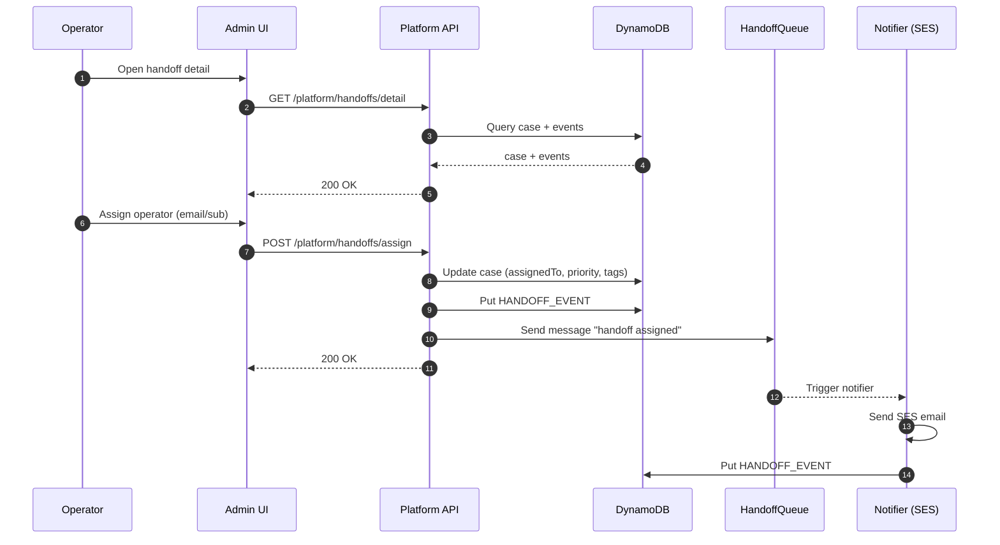
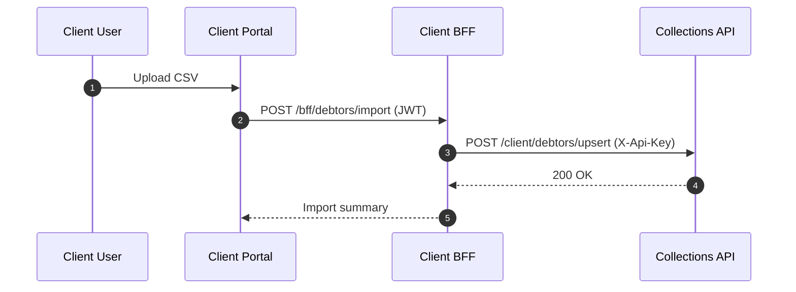

# UX Flows (Mermaid)

## Platform Admin — Assign a handoff case

```mermaid
sequenceDiagram
  autonumber
  participant U as Operator
  participant UI as Admin UI
  participant API as Platform API
  participant DB as DynamoDB
  participant Q as HandoffQueue
  participant N as Notifier (SES)

  U->>UI: Open handoff detail
  UI->>API: GET /platform/handoffs/detail
  API->>DB: Query case + events
  DB-->>API: case + events
  API-->>UI: 200 OK

  U->>UI: Assign operator (email/sub)
  UI->>API: POST /platform/handoffs/assign
  API->>DB: Update case (assignedTo, priority, tags)
  API->>DB: Put HANDOFF_EVENT#ASSIGNED
  API->>Q: Send message "handoff assigned"
  API-->>UI: 200 OK

  Q-->>N: Trigger notifier
  N->>N: Send SES email
  N->>DB: Put HANDOFF_EVENT#EMAIL_SENT
```

## Client Portal — Upload debtors (via BFF)

```mermaid
sequenceDiagram
  autonumber
  participant C as Client User
  participant UI as Client Portal
  participant BFF as Client BFF
  participant API as Collections API

  C->>UI: Upload CSV
  UI->>BFF: POST /bff/debtors/import (JWT)
  BFF->>API: POST /client/debtors/upsert (X-Api-Key)
  API-->>BFF: 200 OK
  BFF-->>UI: Import summary
```
